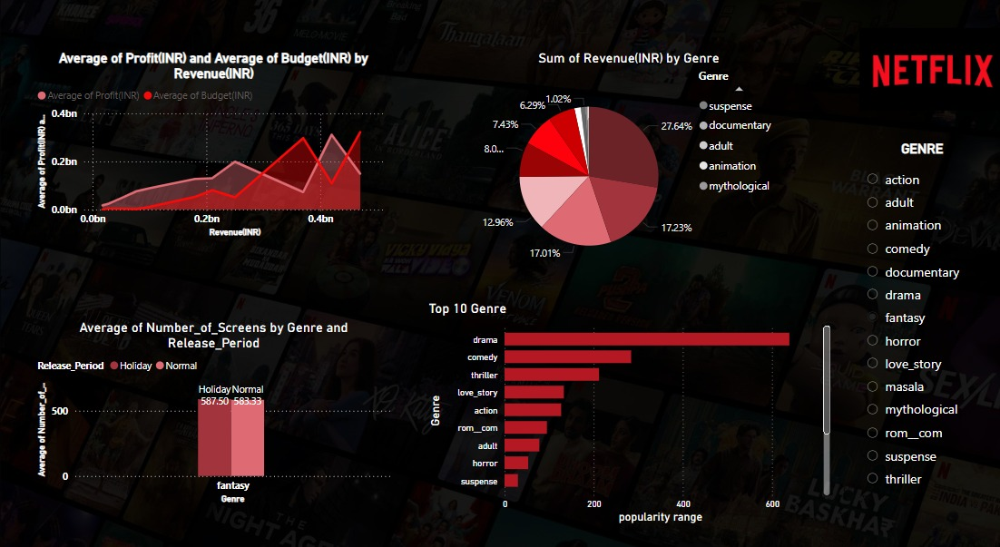

# 📊 Netflix Movies Analysis Dashboard  

This repository contains a **Power BI dashboard** that analyzes movies available on Netflix using various metrics such as revenue, genre popularity, profit, budget, and number of screens.  

## 📂 Files in this Repository  
- **Dashboard.pbix** - The Power BI file containing the dashboard.  
- **cleaned_dataset1.xlsx** - The cleaned dataset used for analysis.  
- **Dashboard.jpg** - A screenshot of the Power BI dashboard.  
- **README.md** - This file.  

## 📌 Features of the Dashboard  
- **Revenue & Profit Analysis**: Visualizes the relationship between revenue, budget, and profit.  
- **Genre-Based Revenue Breakdown**: Displays revenue contribution from different genres.  
- **Screen Count Analysis**: Compares the number of screens during holiday and normal release periods.  
- **Top Genres by Popularity**: Highlights the most popular genres on Netflix.  

## 🚀 Getting Started  
To view and modify the dashboard:  
1. Download **Dashboard.pbix** from this repository.  
2. Open it using **Power BI Desktop**.  
3. Ensure that the **cleaned_dataset1.xlsx** file is in the correct location if needed for any updates.  

## 📸 Dashboard Preview  
  

## 📜 License  
This project is for educational purposes. Feel free to use and modify it.  

---

